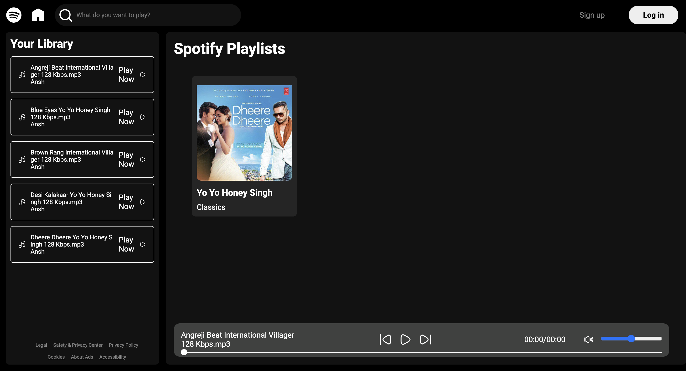

# Spotify Clone 🎵


---

## Project Overview

This is a **Spotify Clone** built using **HTML, CSS, and JavaScript**.  
It mimics the layout and functionality of Spotify’s web player interface.

---

## Features

- Responsive layout like Spotify web
- Play/pause functionality for demo songs
- Styled playlist section
- Smooth UI/UX experience

---

## Tech Stack

- **HTML5** for structure
- **CSS3** for styling
- **JavaScript** for functionality

---

## Screenshots



---

## Setup Instructions

1. Clone the repository:  
```bash
git clone https://github.com/anshsingh1032/spotify-clone.git
